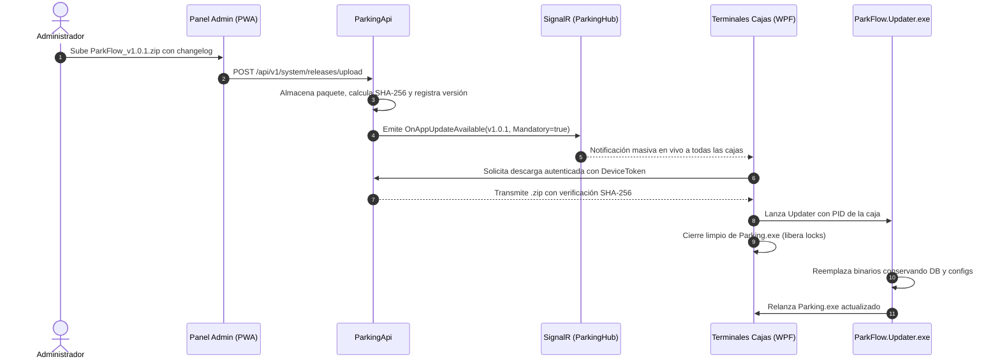

# 📦 Protocolo Oficial de Instalación, Licenciamiento y Actualizaciones Remotas
## ParkFlow Desktop (WPF .NET 10) & Parking API Central

> **Estado**: Documento Arquitectónico y Especificación Técnica Oficial  
> **Fecha de Creación**: 2026-09-09  
> **Versión**: 1.0.0  
> **Audiencia**: Arquitectos de Software, Desarrolladores y Administradores de Infraestructura  

---

## 📑 Tabla de Contenido
1. [Visión General y Objetivos de Negocio](#1-visión-general-y-objetivos-de-negocio)
2. [Arquitectura de Licenciamiento y Enlace a Hardware (Hardware Binding)](#2-arquitectura-de-licenciamiento-y-enlace-a-hardware-hardware-binding)
3. [Flujo de Primer Arranque e Instalación](#3-flujo-de-primer-arranque-e-instalación)
4. [Seguridad Criptográfica del Endpoint de Actualizaciones](#4-seguridad-criptográfica-del-endpoint-de-actualizaciones)
5. [Orquestación de Actualizaciones Masivas en Producción](#5-orquestación-de-actualizaciones-masivas-en-producción)
6. [Manejo Seguro del Proceso de Reemplazo (Micro-Updater)](#6-manejo-seguro-del-proceso-de-reemplazo-micro-updater)
7. [Protección de Datos Locales y Continuidad Operativa](#7-protección-de-datos-locales-y-continuidad-operativa)
8. [Matriz de Seguridad y Anti-Piratería](#8-matriz-de-seguridad-y-anti-piratería)

---

## 1. Visión General y Objetivos de Negocio

El sistema ParkFlow opera en puntos de venta críticos (cajas de parqueadero) donde confluyen hardware local (impresoras térmicas, lectores de código de barras, cajones monederos), dinero en efectivo y operación fuera de línea (resiliencia offline).

### Objetivos Clave:
* **Control Estricto de Dispositivos (Anti-Copia)**: Garantizar que una sede solo pueda utilizar el número exacto de cajas contratadas. Si un usuario copia la carpeta del software a otro computador o memoria USB, el sistema **no debe arrancar**.
* **Protección de la Propiedad Intelectual**: El paquete compilado de la aplicación nunca debe descargarse de forma anónima o pública; solo terminales autorizadas y con licencia vigente pueden acceder a los binarios.
* **Actualización Masiva y Centralizada**: Capacidad de empujar actualizaciones a 10, 50 o cientos de cajas a nivel nacional en minutos vía SignalR, sin soporte presencial ni conexiones remotas (AnyDesk).
* **Cero Pérdida de Datos**: Las actualizaciones reemplazan binarios ejecutables, pero **nunca** alteran la base de datos local SQLite (`parkflow_local.db`), la configuración de la sede ni los turnos con dinero en curso.

---

## 2. Arquitectura de Licenciamiento y Enlace a Hardware (Hardware Binding)

Para evitar la piratería y el uso no autorizado en equipos no contratados, el software implementa un sistema de **Huella Digital de Hardware (Machine Fingerprint)** inmutable.

```mermaid
flowchart TD
    subgraph PC Local (Caja)
        A[Motherboard UUID] --> D[Generador de Huella]
        B[CPU Processor ID] --> D
        C[BIOS Serial Number] --> D
        D --> E[Hash SHA-256: MachineFingerprint]
    end

    subgraph Proceso de Activación
        E --> F[Ingreso de Licencia: PKF-XXXX-XXXX]
        F --> G[Llamada Segura: POST /api/v1/licenses/activate]
    end

    subgraph Backend Central (ParkingApi)
        G --> H{¿Licencia Válida y con Cupo?}
        H -->|No| I[Rechazar Activación: Error 403]
        H -->|Sí| J[Vincular MachineFingerprint a Sede]
        J --> K[Emitir DeviceToken Criptográfico DPAPI]
    end

    K --> L[Guardar Token Seguro en Windows Credential Store]
```

### 2.1 Generación de la Huella de Hardware (`HardwareFingerprintService`)
Se consultan identificadores de bajo nivel a través de WMI (Windows Management Instrumentation) que no cambian con el formateo del sistema operativo:
* `Win32_BaseBoard.SerialNumber`: Número de serie de la placa madre.
* `Win32_Processor.ProcessorId`: Identificador del silicio del CPU.
* `Win32_ComputerSystemProduct.UUID`: Identificador universal único asignado por el fabricante del BIOS.

$$\text{MachineFingerprint} = \text{HMAC-SHA256}(\text{MotherboardSerial} + \text{CpuId} + \text{BiosUuid}, \text{SaltInterno})$$

### 2.2 Estructura de la Licencia
* **Formato**: `PKF-[COMPANY]-[BRANCH]-[SLOTS]-[CHECKSUM]` (Ej: `PKF-CLIC-SEDE01-02-A8D9F2`)
* **Propiedades en Base de Datos Central (`DeviceLicenses`)**:
  * `LicenseKey`: Clave única alfanumérica.
  * `CompanyId` / `BranchId`: Sede asignada.
  * `MaxAllowedDevices`: Cantidad máxima de terminales (ej: 2 cajas).
  * `ActiveDevicesCount`: Conteo actual de máquinas activadas.
  * `ExpirationDate`: Fecha límite del contrato de servicio.
  * `Status`: `Active`, `Suspended`, `Revoked`.

---

## 3. Flujo de Primer Arranque e Instalación

### 3.1 Proceso con Instalador Gráfico (Wizard de Activación)
1. **Instalación de Archivos**:
   * El instalador (Inno Setup / MSI) instala la aplicación en `%LocalAppData%\Programs\ParkFlow\` (lo que evita requerir permisos de administrador de Windows UAC para futuras actualizaciones).
2. **Primer Lanzamiento**:
   * La aplicación verifica si existe el archivo de autorización criptográfico local (`license.dat`).
   * Si no existe o no coincide con la máquina actual, despliega el **Diálogo de Activación de Terminal (Device Activation Dialog)**.
3. **Solicitud de Activación**:
   * El instalador o técnico digita la `Clave de Licencia`.
   * El sistema envía al backend:
     ```json
     {
       "licenseKey": "PKF-CLIC-SEDE01-02-A8D9F2",
       "machineFingerprint": "e3b0c44298fc1c149afbf4c8996fb92427ae41e4649b934ca495991b7852b855",
       "machineName": "CAJA-01-NORTE",
       "windowsUser": "Operador1",
       "appVersion": "1.0.0"
     }
     ```
4. **Respuesta del Servidor**:
   * Si la licencia está al día y tiene cupos disponibles:
     * Registra el dispositivo en la tabla `RegisteredDevices`.
     * Retorna un `DeviceToken` firmado digitalmente por el servidor.
     * El token se almacena cifrado en Windows utilizando **DPAPI (Data Protection API)**: solo la cuenta de usuario de ese PC específico puede descifrarlo.
5. **Detección de Clonación**:
   * Si alguien copia la carpeta a otro computador, DPAPI fallará o el `MachineFingerprint` no coincidirá con la firma del `DeviceToken`. El software se bloquea de inmediato:
     > *"Dispositivo No Autorizado: Esta instalación ha sido copiada o modificada. Contacte a soporte técnico."*

---

## 4. Seguridad Criptográfica del Endpoint de Actualizaciones

> [!CAUTION]
> **REGLA DE ORO DE SEGURIDAD**: El paquete ejecutable (`.zip`) de actualización de ParkFlow **NUNCA** debe exponerse en un endpoint anónimo o público.

### 4.1 Mecanismo de Autenticación de Máquina (Machine-to-Server Auth)
El endpoint de descarga exige tres cabeceras HTTP criptográficas obligatorias:

```http
GET /api/v1/system/updates/download/v1.0.1 HTTP/1.1
Host: api.parking-flow.com
X-Device-Token: eyJhbGciOiJIUzI1NiIsInR5cCI6IkpXVCJ9...
X-Machine-Fingerprint: e3b0c44298fc1c149afbf4c8996fb924...
X-Request-Timestamp: 2026-09-09T21:00:00Z
X-Request-Signature: HMAC-SHA256(Url + Timestamp, DeviceSecret)
```

### 4.2 Validaciones que Ejecuta el Servidor antes de Entregar 1 Solo Byte:
1. **Validación de Firma**: Verifica que la petición provenga genuinamente del binario legítimo y no de una herramienta externa (curl/Postman) falsificando cabeceras.
2. **Validación de Licencia y Estado de Sede**:
   * ¿La sede tiene el contrato activo?
   * ¿El `MachineFingerprint` coincide con el dispositivo registrado en la tabla `RegisteredDevices`?
3. **URL Temporal Prefirmada (One-Time Signed URL)**:
   * Si todo es válido, el servidor genera un token de descarga de un solo uso con expiración estricta de **5 minutos**.
   * Transmite el archivo por streaming directo mediante `FileStreamResult`.

---

## 5. Orquestación de Actualizaciones Masivas en Producción



---

## 6. Manejo Seguro del Proceso de Reemplazo (Micro-Updater)

Windows bloquea los archivos que están en memoria (`ERROR_SHARING_VIOLATION` o `ERROR_ACCESS_DENIED`). Para eludir este bloqueo de manera 100% confiable:

### 6.1 Parámetros de Invocación de `ParkFlow.Updater.exe`
```powershell
ParkFlow.Updater.exe --pid 4512 --zip "C:\Users\...\AppData\Local\ParkFlow\Temp\update_v1.0.1.zip" --target "C:\Users\...\AppData\Local\Programs\ParkFlow" --sha256 "D41D8CD98F00B204E9800998ECF8427E..." --restart
```

### 6.2 Lógica del Micro-Updater
1. **Espera de Cierre**: Monitorea el PID del proceso padre (`Parking.exe`) hasta que termine (`process.WaitForExit(10000)`).
2. **Verificación Criptográfica Local**: Compara el hash SHA-256 del archivo descargado antes de descomprimir. Si no coincide, aborta sin tocar ningún archivo preexistente.
3. **Descompresión Selectiva (Regla de Exclusión Estricta)**:
   * **Se Reemplazan**: Archivos `.exe`, `.dll`, `.pdb`, `runtimes/`, recursos visuales.
   * **ESTRICTAMENTE EXCLUIDOS (NO TOCAR NUNCA)**:
     * `parkflow_local.db*` (SQLite base de datos).
     * `appsettings.Production.json` / `appsettings.json`.
     * `license.dat` (Credencial de máquina).
     * Carpeta `Logs/`.
4. **Relanzamiento y Auto-Limpieza**: Ejecuta el nuevo `Parking.exe`, elimina el `.zip` temporal y finaliza su propio proceso.

---

## 7. Protección de Datos Locales y Continuidad Operativa

### 7.1 Manejo de Turnos de Caja Abiertos
Si la actualización obligatoria llega en medio del turno operativo de un cajero:
1. El sistema despliega un aviso prominente con un **temporizador de cortesía de 3 a 5 minutos**.
2. Permite al cajero completar el cobro o impresión del tiquete en curso.
3. Realiza un *flush* de transacciones pendientes hacia SQLite y hacia el API si hay conexión disponible.
4. Al reiniciarse la aplicación con la nueva versión, el cajero inicia sesión nuevamente y su turno continúa activo con el saldo exacto y sin desfases.

---

## 8. Matriz de Seguridad y Anti-Piratería

| Vector de Amenaza | Riesgo | Mecanismo de Defensa en ParkFlow |
| :--- | :---: | :--- |
| **Descarga no autorizada del software** | Crítico | Endpoint protegido con `DeviceToken`, firma HMAC y validación de contrato activo en base de datos. |
| **Copia ilegal a otros computadores** | Crítico | **Hardware Binding**: Enlace a la placa madre/CPU. Si el hardware cambia, el software no arranca sin reactivación del admin. |
| **Agotamiento fraudulento de cupos** | Alto | El backend cuenta las terminales activas (`ActiveDevicesCount`) e impide activar más de las contratadas. |
| **Manipulación del ejecutable (Cracking)** | Alto | Ofuscación con herramientas de protección de ensamblados .NET y validación de firma de código. |
| **Descargas corruptas o incompletas** | Medio | Verificación estricta de hash SHA-256 antes de iniciar la rutina de descompresión. |

---
*Fin del documento oficial de arquitectura de instalación y actualización.*
